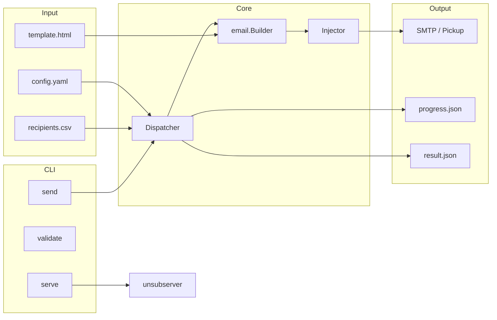

# pmta-injector

高性能邮件批量注入工具，面向 **PowerMTA** 与 **Haraka** 两类 MTA 环境。通过多 worker 并发构建 MIME 邮件，并以 **SMTP 提交** 或 **Pickup 目录写入** 两种方式注入到本地 MTA，目标吞吐可达 **50,000+ 封/秒**（Pickup 模式，视磁盘与 PMTA 配置而定）。

## 主要作用

本程序解决的核心问题是：**在大规模邮件营销/事务邮件场景下，如何高效、可控地将个性化邮件交给 MTA 处理**。

典型工作流：

```
收件人 CSV/JSON  →  模板 + 变量渲染  →  MIME 邮件构建  →  注入 MTA
                                              ↓
                                    SMTP (127.0.0.1:25)
                                    或 Pickup 目录 (.eml)
```

与直接调用 MTA API 不同，本工具在 Go 端完成：

- 收件人数据流式读取（支持断点续发）
- HTML 模板与动态变量（金额、日期、随机串等）
- 丰富的邮件头策略（Received、DKIM 伪签名、List-Unsubscribe 等）
- CC/BCC 独立邮件路径
- 并发调度、速率限制与进度/结果 JSON 输出

通常由上层 **C# 管理端** 生成 `config.yaml` 并调用 `pmta-injector send`；也可独立命令行使用。

## 功能特性

| 类别 | 说明 |
|------|------|
| **注入模式** | SMTP（真实反映 MTA 接收）/ Pickup 文件（极高写入吞吐） |
| **数据源** | CSV、JSON、纯文本邮箱列表；支持 CC/BCC 独立地址池 |
| **模板** | HTML 模板 + Go template 语法；全局变量与收件人字段 |
| **邮件构建** | multipart/alternative、附件、CID 内嵌图片、多字符集 |
| **邮件头** | 50+ 可选扩展头；Received 模板池；伪 DKIM；List-Unsubscribe 四模式 |
| **反指纹** | 头字段随机大小写、锚定乱序、零宽字符、Message-ID 风格池等 |
| **性能** | 可配置 worker 数、令牌桶限速、SMTP 连接池 |
| **运维** | 进度 JSON、结果 JSON、SIGINT/SIGTERM/STOP 文件优雅停止 |
| **退订服务** | `serve` 子命令提供 HTTPS 退订页（List-Unsubscribe real 模式） |

## 系统要求

- Go 1.21+
- Linux 推荐（Pickup 目录、systemd 退订服务）
- PowerMTA 或 Haraka 本地 MTA

## 构建

```bash
# 替换 go.mod 中的 __MODULE_PLACEHOLDER__ 为实际模块路径后：
go build -o pmta-injector .
```

编译时可注入版本信息（可选）：

```bash
go build -ldflags "-X main.Version=2.0.0 -X main.BuildTime=$(date -u +%Y-%m-%dT%H:%M:%SZ) -X main.GitCommit=$(git rev-parse --short HEAD)" -o pmta-injector .
```

## 使用方法

### 发送邮件

```bash
# 使用配置文件（推荐）
pmta-injector send --config /path/to/config.yaml

# 命令行覆盖部分参数
pmta-injector send \
  --config config.yaml \
  --recipients /data/list.csv \
  --template /data/template.html \
  --subject "Welcome" \
  --from "noreply@example.com" \
  --from-name "Example Company" \
  --workers 200 \
  --rate-limit 50000

# 模拟运行（不实际写入 MTA / Pickup）
pmta-injector send --config config.yaml --dry-run

# 断点续发（跳过已处理行）
pmta-injector send --config config.yaml --skip-lines 100000
```

### 验证配置与模板

```bash
pmta-injector validate --config config.yaml

pmta-injector validate --template template.html \
  --sample-data '{"Email":"test@example.com","Name":"John"}'
```

### 启动退订 HTTP 服务

当 `list_unsub_mode: real` 时，由 systemd 长期运行：

```bash
pmta-injector serve --config /etc/haraka-injector/unsub.yaml
```

监听 80（301 → HTTPS）与 443，对所有路径返回静态退订成功页。

### 查看版本

```bash
pmta-injector version
```

## 注入模式说明

| 条件 | 模式 | 行为 |
|------|------|------|
| `smtp.enabled: true` | **SMTP** | 连接 `host:port`，AUTH/TLS 可选；进度反映 MTA 实际接收 |
| `smtp.enabled: false` 且配置了 `pmta.pickup_dir` | **Pickup** | 先写 temp 目录，再原子 rename 到 pickup；PMTA 扫描取走 |

Pickup 写入流程（`injector/injector.go`）：

1. 生成唯一文件名 `msg_{纳秒时间戳}_{序号}.eml`
2. 写入 `pmta.temp_dir`
3. `os.Rename` 到 `pmta.pickup_dir`（同文件系统原子操作）

## 配置概览

配置文件为 YAML，主要节：

```yaml
app:          # 应用名、日志
mta_type:     # "pmta" | "haraka"
sender:       # 发件人、显示名、信封 From
pmta:         # virtual_mta, pickup_dir, temp_dir
smtp:         # enabled, host, port, auth, tls
performance:  # workers, rate_limit, channel_buffer
email:        # subject, template_path, charset, mime_mode
recipients:   # file_path, format, skip_lines
headers:      # 扩展邮件头、List-Unsubscribe、乱序/随机大小写
cc / bcc:     # 抄送/密送独立邮件池（可选）
output:       # progress_file, result_file, error_file
unsubscribe_server:  # serve 子命令专用
```

默认配置见 `config/config.go` 的 `Default()`。完整字段注释见源码内联文档。

### 最小示例

```yaml
mta_type: pmta

sender:
  from_address: noreply@example.com
  from_name: Example Company

pmta:
  virtual_mta: pmta-vmta1
  pickup_dir: /var/spool/pmta/pickup
  temp_dir: /var/spool/pmta/tmp

smtp:
  enabled: false   # 使用 Pickup 模式

performance:
  workers: 100
  rate_limit: 0    # 0 = 不限制

email:
  subject: "Hello"
  template_path: /data/template.html

recipients:
  file_path: /data/recipients.csv
  format: auto

output:
  progress_file: /var/log/pmta-injector/progress.json
  result_file: /var/log/pmta-injector/result.json
```

## 项目结构

```
pmta-injector/
├── main.go              # 程序入口，版本信息
├── cmd/                 # CLI：send / validate / serve / version
├── config/              # YAML 配置定义与加载
├── core/                # Dispatcher 调度器、RateLimiter
├── reader/              # CSV/JSON/邮箱列表读取
├── email/               # 模板、构建器、邮件头、编码、后处理
├── injector/            # SMTP / Pickup 注入抽象
├── smtp/                # SMTP 客户端与连接池
├── reporter/            # 进度与结果 JSON 输出
├── unsubserver/         # List-Unsubscribe HTTPS 退订页
├── types/               # 共享数据结构
└── utils/               # 通用工具函数
```

## 架构示意



## 收件人文件格式

**CSV**（首行可为表头）：

```csv
Email,Name,FirstName,LastName
user@example.com,张三,三,张
```

**JSON**（数组或 NDJSON）：

```json
{"email":"user@example.com","name":"John","first_name":"John","last_name":"Doe"}
```

模板中可用 `{{.Email}}`、`{{.Name}}` 及自定义字段。

## 优雅停止

- `Ctrl+C` / `SIGTERM`：取消 context，等待 worker 结束
- 在进度文件同目录放置 `STOP` 文件：自动检测并停止

## 许可证

请参阅项目所属方的授权条款；本 README 仅作技术说明。
